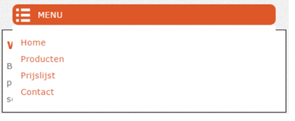
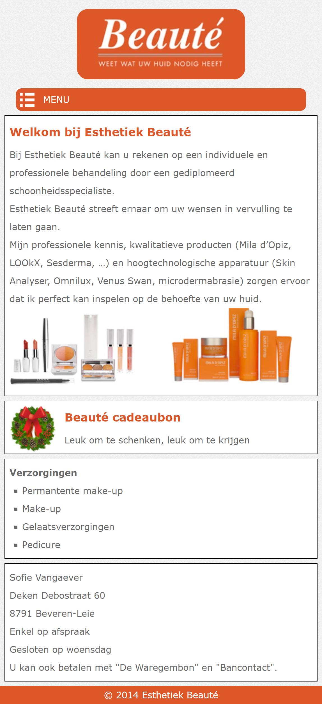

# Oefeningen hoofdstuk 6: Responsive
1. Download of clone deze repository. Hiervoor klik je op de groene knop.
2. Pak deze zip uit in de map waar je alle leermateriaal van Webapplicaties I plaatst.
3. Ga nu naar Visual Studio Code en open deze map.

## OEFENING 1: Cnockaert.

Open de map **Cnockaert**:

Zorg ervoor dat deze webpagina mobile-first responsive is. De body van de index.html is definitief en mag niet gewijzigd worden.
Gebruik waar nodig enkel relatieve eenheden. Zorg ervoor dat voor bepaalde elementen de box-sizing de waarde border-box (width = content+padding+border) heeft. 

- Pas de css aan in cnockaert.css. Voeg de geapste stijlregels toe zodat de webpagina correct wordt weergegeven op de kleinste schermgrootte: smartphone / tablet. 
- Voeg daarna de stijlregels toe om de correcte weergave te hebben op schermen met een breedte groter dan 990px.
- Maak **uitsluitend** gebruik van **float layout**.

### **Smartphone en tablet weergave**

### **Desktop weergave**
- De breedte van het linkse gedeelte is 75% van de totale breedte.
- De breedte van het rechtse gedeelte is 25% van de totale breedte.

---

## OEFENING 2: Beauté.

Het project bevat reeds de pagina index.html en de volgende mappen:

- css: bevat het bestand beaute.css.
- images: bevat de afbeeldingen

In deze oefening moet je zelf de mobile first responsive website maken die in de onderstaande figuren staan afgebeeld. De zwarte randen in deze figuren zijn enkel om de elementen duidelijker af te bakenen.

- Deze website is mobile first responsive. De css bevat reeds alle algemene stijlregels:
    - Als we een breedte instellen, dan slaat die breedte op de content, de padding en de border, niet enkel op de content
    - De maximumbreedte voor alle afbeeldingen is 100%
    - Het gebruikte lettertype is Verdana of Arial. Het is sowieso een schreefloos lettertype.
    - De line-heigth is 2.
    - De tekstkleur is dimgray
- De weergave verandert wanneer de breedte van het scherm groter wordt dan 768px.
- Maak uitsluitend gebruik van float–layout om de website te maken.
- Voeg eerst de specifieke stijlregels voor de smartphone / tablet weergave (screen breedte < 769px) toe. 
### Algemene opmaakkenmerken

- De achtergrondafbeelding is background.gif
- Het oranje dat her en der in de webpagina gebruikt wordt is `#DE5728`.
- De menu – items zijn:
    - Home
    - Producten 
    - Prijslijst 
    - Contact

### Opmaakkenmerken van de smartphone / tablet weergave

- Het logo is `logo-esthetiek-beaute.jpg`. Het logo is gecentreerd en heeft afgeronde hoeken.
- Het menu neemt 90% van de volledige breedte in en heeft afgeronde hoeken en is gecentreerd.
- Zorg ervoor dat het menu enkel zichtbaar wordt bij het hoveren over de menubalk, de menuitems worden over de onderliggende tekst weergegeven (zie figuur hieronder). De menubalk bevat enkel het hamburger icoon (menu-icon.png) en de tekst **MENU**. Tip om de menuitems op de correcte plaats weer te geven (boven de onderstaande tekst): gebruik de eigenschap **position**. 
- De menu items nemen ook 90% van de volledige breedte in en hebben een oranje tekstkleur. Als over een menu item gehovered wordt, wordt de tekst in het vet weergegeven.

    

### Opmaakkenmerken van de desktop weergave

- De maximum breedte van de webpagina is 900px. De inhoud van de header en main zijn gecentreerd.
- De links hebben een grijze `#666` tekstkleur.
- Als over een menu – item gehovered wordt, komt de tekst in het zwart te staan.
- De link van de actieve pagina is oranje.
- Het linkse gedeelte is 30% breed, het rechtse is 70% van de totale breedte.

### **Smartphone en tablet weergave**

### **Desktop weergave**

---

## OEFENING 3: Yoko.

We starten met het resultaat uit vorige les, dit is de desktop view (vanaf 992px)

## **Smartphone weergave**

## **Tablet weergave (vanaf 480px)**

Vul de viewport aan in het html document.
In het css bestand staan reeds aanwijzingen wat aan te passen.

- Declareer de opmaak (niet device gebonden):
- zorg ervoor dat width en height content/padding/border omvat
- algemene eigenschappen: font-family – color – achtergrond – lijnhoogte…
- opmaak voor de verschillende logische blokken.
- opmaak voor headers - anchors – images - …

Bepaal opmaak en layout voor kleinste device:

- 1 kolom.
- menubalk vervangen door icon met uitklapmenu (verborgen).
- belangrijkste content bovenaan.

Na de algemene opmaak en layout voor het kleinste device, worden enkel die eigenschappen aangepast die nodig zijn om de layout bij te sturen voor tablets (width > 480 px en width < 992px).

- Verplaats bepaalde logische blokken (float), zodat de 1-kolom layout wordt doorbroken.
- Pas eventueel ook margin en padding aan indien nodig.
- Verberg de nodige afbeelding(en) – icoon en voeg de juiste afbeeldingen toe (HTML) maak de juist afbeeldingen zichtbaar.
- Pas eventueel background-images aan.
- Pas eventueel layout van menubalk aan.
- Voor de images (header – main content) maken we gebruik van het picture element. Hier is het mogelijk om aan de hand van breakpoints andere afbeeldingen weer te geven – hiervoor maken we gebruik van het source element en het srcset attribuut.
  

- Tot slot pas je de layout aan voor de desktop (> 992px).
- Eventueel images aanpassen.
- Margin - padding aanpassen.
- Verhoudingen tussen kolommen aanpassen.
