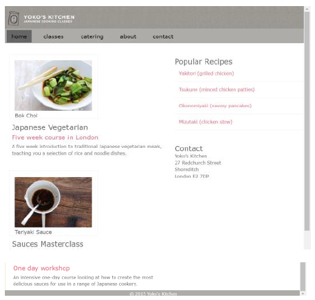

# Oefeningen hoofdstuk 6: Responsive

Download of clone deze repository. Hiervoor klik je op de groene knop.

Pak deze zip uit in de map waar je alle leermateriaal van Webapplicaties I plaatst.

Ga nu naar Visual Studio Code en open deze map.

## OEFENING 1: Cnockaert.

Open de map **Cnockaert**:

In deze oefening moet je zelf de website maken die in de onderstaande figuren staat afgebeeld. Exacte waarden voor kleuren, padding en margin zijn in deze oefening van minder belang. De essentie is dat de structuur correct is en dat je tot een mobile first responsive website komt.

- Deze website is mobile first responsive. Begin daarom met het maken van de smartphone / tablet weergave. Voeg pas daarna de stijlregels toe om te veranderen naar desktop weergave.
- De weergave verandert wanneer de breedte van het scherm groter wordt dan 990px.
- Maak uitsluitend gebruik van float–layout om de website te maken.
- Garage Cnockaert + Aanbiedingen => h1.
- Officiële dealer van / Kia, 7 jaar garantie / Contact / Fiat 500 C / Fiat Panda / Fiat Qubo => h3

### **Smartphone en tablet weergave**

### **Desktop weergave**

**Enkele opmaakkenmerken van de desktop weergave**

- Het centrale gedeelte heeft een breedte van 890px en is gecentreerd.
- De breedte van het linkse gedeelte is 75% van de totale breedte.
- De maximum breedte van elk van de 3 afbeeldingen van de auto’s is 195px

---

## OEFENING 2: Beauté.

Het project bevat reeds de pagina index.html en de volgende mappen:

- css: bevat het bestand beaute.css.
- images: bevat de afbeeldingen

In deze oefening moet je zelf de mobile first responsive website maken die in de onderstaande figuren staat afgebeeld. De zwarte randen in deze figuren zijn enkel om de elementen duidelijker af te bakenen.

1. Deze website is mobile first responsive. Begin daarom met het maken van de smartphone / tablet weergave. Voeg pas daarna de stijlregels toe om te veranderen naar desktop weergave.
2. De weergave verandert wanneer de breedte van het scherm groter wordt dan 768px.
3. Maak uitsluitend gebruik van float–layout om de website te maken.
4. Maak zo weinig mogelijk gebruik van id’s.
5. Sommige opmaakkenmerken zijn al gegeven

- Als we een breedte instellen, dan slaat die breedte op de content, de padding en de border, niet enkel op de content
- De maximumbreedte voor alle afbeeldingen is 100%
- Het gebruikte lettertype is Verdana of Arial. Het is sowieso een schreefloos lettertype.
- De line-heigt is 2.
- De tekstkleur is dimgray

**Algemene opmaakkenmerken**

6. De achtergrondafbeelding is background.gif
7. Het oranje dat her en der in de webpagina gebruikt wordt is #DE5728
8. De menu – items zijn: Home / Producten / Prijslijst / Contact

**Enkele opmaakkenmerken van de smartphone / tablet weergave**

9. Het logo is logo-esthetiek-beaute.jpg. Het logo is gecentreerd en heeft afgeronde hoeken.
10. Het menu neemt 90% van de volledige breedte in en heeft afgeronde hoeken. De menu items nemen ook 90% van de volledige breedte in en hebben een oranje tekstkleur. Als over een menu item gehovered wordt, komt de tekst in vet

    

11. Zoals de te zien op de voorbeelden, is er een kleine doorzichtige rand rondom de elementen. De inhoud van de elementen staat niet tegen de rand geplakt
12. Welkom bij Esthetiek Beauté / Weet wat uw huid nodig heeft … / Beauté cadeaubon zijn h2 elementen met een oranje kleur en 20px groot
13. De inhoud van de footer is gecentreerd

**Enkele opmaakkenmerken van de desktop weergave**

14. De maximum breedte van de webpagina is 900px. De inhoud van de webpagina is gecentreerd
15. Maak gebruik van margin-left om de navigatiebalk rechts te plaatsen. Maak gebruik van een percentage.
16. De links hebben een grijze (#666) tekstkleur.

- Als over een menu – item gehovered wordt, komt de tekst in zwart
  De link van de actieve pagina staat in oranje
  17 Het is belangrijk dat alles netjes uitgelijnd staat.
- Respecteer de afmetingen zoals op de onderstaande figuur opgegeven, maar maak gebruik van percentages. Deze figuur geeft schematisch een deel van de webpagina weer. De afmetingen zijn geldig voor het geval de breedte van het centrale gedeelte 900px is
- De breedte van het logo moet je niet instellen, want dit is 300px
- Omdat de top-margin en de bottom-margin berekend worden op basis van de breedte en omdat dit niet tot een column – drop kan leiden, kan je hier beter gebruik maken van em’s
  

### **Smartphone en tablet weergave**

### **Desktop weergave**

---

## OEFENING 3: Yoko.

We starten met het resultaat uit vorie les, dit is de desktop view (vanaf 992px)

## **Smartphone weergave**

## **Tablet weergave (vanaf 480px)**

Vul de viewport aan in het html document.
In het css bestand staan reeds aanwijzingen wat aan te passen.

- Declareer de opmaak (niet device gebonden):
- zorg ervoor dat width en height content/padding/border omvat
- algemene eigenschappen: font-family – color – achtergrond – lijnhoogte…
- opmaak voor de verschillende logische blokken.
- opmaak voor headers - anchors – images - …

Bepaal opmaak en layout voor kleinste device:

- 1 kolom.
- menubalk vervangen door icon met uitklapmenu (verborgen).
- belangrijkste content bovenaan.

Na de algemene opmaak en layout voor het kleinste device, worden enkel die eigenschappen aangepast die nodig zijn om de layout bij te sturen voor tablets (width > 480 px en width < 992px).

- Verplaats bepaalde logische blokken (float), zodat de 1-kolom layout wordt doorbroken.
- Pas eventueel ook margin en padding aan indien nodig.
- Verberg de nodige afbeelding(en) – icoon en voeg de juiste afbeeldingen toe (HTML) maak de juist afbeeldingen zichtbaar.
- Pas eventueel background-images aan.
- Pas eventueel layout van menubalk aan.
- Voor de images (header – main content) maken we gebruik van het picture element. Hier is het mogelijk om aan de hand van breakpoints andere afbeeldingen weer te geven – hiervoor maken we gebruik van het source element en het srcset attribuut.
  

- Tot slot pas je de layout aan voor de desktop (> 992px).
- Eventueel images aanpassen.
- Margin - padding aanpassen.
- Verhoudingen tussen kolommen aanpassen.
