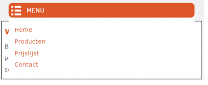
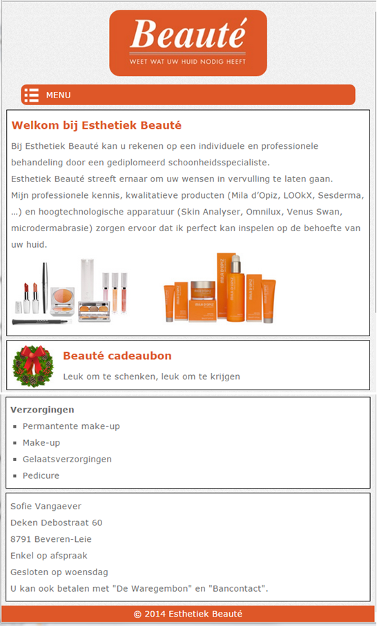
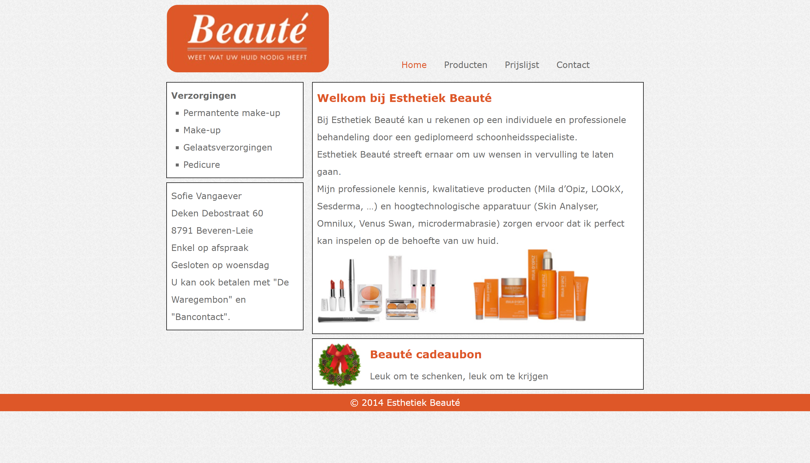

# Oefening Beauté

## Alvorens te beginnen:
- Open de map **Beauté**
- Activeer Live Server

## Online voorbeeld
Hoe de website er uiteindelijk moet uitzien, vind je <a href="https://webapplicaties1.github.io/06solResponsive/beaute/">hier</a>, om deze in smartphone of tablet versie te bekijken kan je het browser venster verkleinen.

## Bestanden
Het project bevat reeds de pagina index.html en de volgende mappen:
- css: bevat het bestand beaute.css.
- images: bevat de afbeeldingen

## Opdracht
In deze oefening moet je zelf de mobile first responsive website maken die in de onderstaande figuren staan afgebeeld. De zwarte randen in deze figuren zijn enkel om de elementen duidelijker af te bakenen.

- De css bevat reeds alle algemene stijlregels:
    - Als we een breedte instellen, dan slaat die breedte op de content, de padding en de border, niet enkel op de content.
    - De maximumbreedte voor alle afbeeldingen is `100%`.
    - Het gebruikte lettertype is `Verdana` of `Arial`. Het is sowieso een schreefloos lettertype.
    - De `line-heigth` is `2`.
    - De tekstkleur is `dimgray`.
- De weergave verandert wanneer de breedte van het scherm **groter** wordt dan `768px`.
- Maak uitsluitend gebruik van `float–layout` om de website te maken.
- Voeg eerst de specifieke stijlregels voor de smartphone / tablet weergave (screen breedte < `769px`) toe. 

### Algemene opmaakkenmerken
- De achtergrondafbeelding is background.gif
- Het oranje dat her en der in de webpagina gebruikt wordt is `#DE5728`.
- De menu – items zijn:
    - Home
    - Producten 
    - Prijslijst 
    - Contact

### Opmaakkenmerken van de smartphone / tablet weergave
- Het logo is `logo-esthetiek-beaute.jpg`. Het logo is gecentreerd en heeft afgeronde hoeken.
- Het menu neemt 90% van de volledige breedte in en heeft afgeronde hoeken en is gecentreerd.
- Zorg ervoor dat het menu enkel zichtbaar wordt bij het hoveren over de menubalk, de menuitems worden over de onderliggende tekst weergegeven (zie figuur hieronder). De menubalk bevat enkel het hamburger icoon (menu-icon.png) en de tekst **MENU**. Tip om de menuitems op de correcte plaats weer te geven (boven de onderstaande tekst): gebruik de eigenschap **position**. 
- De menu items nemen ook 90% van de volledige breedte in en hebben een oranje tekstkleur. Als over een menu item gehovered wordt, wordt de tekst in het vet weergegeven.
    

### Opmaakkenmerken van de desktop weergave
- De maximum breedte van de webpagina is `900px`. De inhoud van de header en main zijn gecentreerd.
- De links hebben een grijze `#666` tekstkleur.
- Als over een menu – item gehovered wordt, komt de tekst in het zwart te staan.
- De link van de actieve pagina is oranje.
- Het linkse gedeelte is 30% breed, het rechtse is 70% van de totale breedte.

### **Smartphone en tablet weergave**

### **Desktop weergave**

